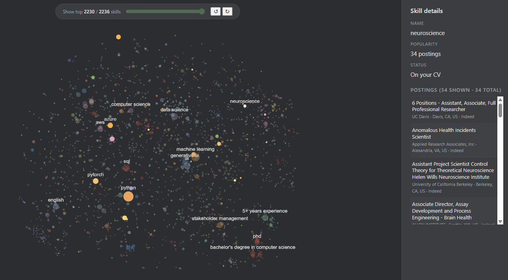

# CareerAtlas

[](https://kedro.org)

<div align="center">

</div>


### Explore where your skills sit in the global job market

CareerAtlas transforms your CV into an interactive map of the modern hiring landscape.
It analyzes real-world job postings, extracts in-demand skills, and visualizes how your experience connects to the market.

Discover:

* which skills recruiters are actively searching for,
* where your profile is uniquely differentiated,
* which adjacent skills unlock new opportunities,
* and how your experience compares to current market demand.



<br><br>

<div align="center">

*Powered by*:

<p float="left">

 

</p>

<p float="left">


</p>
</div>

---
# What am I looking at?

CareerAtlas builds a live **skill map** from real job postings related to your background.

Each dot represents:

* a skill,
* tool,
* framework,
* credential,
* or experience signal.

The map is generated by:

1. Reading your CV,
2. Searching for matching job postings,
3. Extracting recruiter-requested skills,
4. Clustering related concepts,
5. Rendering a market-wide skill map.

### The visualization encodes:

| Visual element | Meaning                                          |
| -------------- | ------------------------------------------------ |
| Dot size       | How frequently a skill appears in postings       |
| Position       | Semantic similarity (t-SNE of skill embeddings)  |
| Green dots     | Skills detected in your CV                       |
| Colour groups  | Career domains and adjacent opportunities        |

This lets you visually explore:

* your strengths,
* missing skills,
* niche expertise,
* and emerging career directions.

---

# How it works?

A local Gemma 4 model (via Ollama) reads your CV and derives targeted job-search queries based on your experience.

CareerAtlas then:

* scrapes job postings using `Adzuna` + `JobSpy` (LinkedIn / Indeed),
* stores results in Parquet,
* extracts recruiter-requested skills from every posting,
* canonicalizes related terms using embeddings,
* and builds a popularity-weighted interactive skill map.

Your own skills are highlighted directly inside the market map so you can immediately see:

* where you fit,
* where demand is concentrated,
* and which nearby skills could expand your opportunities.

---

# Setup

Requirements: Python 3.12, [uv](https://github.com/astral-sh/uv),
[Ollama](https://ollama.com), an Adzuna account (free).

```bash
uv pip install -e ".[dev]"
```

Copy the credentials template and fill in your Adzuna keys
([free at adzuna.com/developer](https://developer.adzuna.com/)):

```bash
cp credentials.template.yml conf/local/credentials.yml
# then edit conf/local/credentials.yml
```

`conf/local/credentials.yml` is gitignored. Never commit it.

Pull the Gemma 4 tag matching your hardware (one-time):

```bash
ollama pull gemma4:e2b
```

<center>

| Tier   | Default Ollama tag | Hardware                     |
| ------ | ------------------ | ---------------------------- |
| `low`  | `gemma4:e2b`       | CPU / 8 GB GPU               |
| `mid`  | `gemma4:e4b`       | 12 GB GPU (default)          |
| `high` | `gemma4:26b`       | 24 GB GPU (MoE, 3.8B active) |
| `max`  | `gemma4:31b`       | 32 GB+ GPU (dense)           |

</center>

Pick a tier in `conf/local/parameters/cv_extraction.yml`:

```yaml
cv_extraction:
  hardware_tier: low
```

Custom tags / remote hosts go in the same local YAML by overriding
`model_registry.<tier>.ollama_tag` or `ollama.host`.

---

# Run

## Web UI

Launch the local browser app, paste your CV, and explore your career map interactively:

```bash
career-atlas-ui
# → open http://127.0.0.1:8000/
```

The UI streams live progress during:

* CV analysis,
* job scraping,
* skill extraction,
* clustering,
* and map generation.

Under the hood, the app executes the same three Kedro pipelines:

```text
cv_extraction → scraping → skill_map
```

---

## CLI

Drop your CV as:

```text
data/01_raw/cv/cv.md
```

Then run:

```bash
kedro run --pipeline=cv_extraction
kedro run --pipeline=scraping
kedro run --pipeline=skill_map
kedro run
```

First run produces:

```text
data/03_primary/job_postings.parquet
```

Subsequent runs:

* update `last_seen_at` for existing postings,
* append only newly discovered jobs,
* and reuse cached skill extractions to avoid repeated LLM calls.

---

# What the LLM produces

Intermediate artifacts in `data/02_intermediate/`:

| File                              | Description                                                  |
| --------------------------------- | ------------------------------------------------------------ |
| `cv_profile.json`                 | Structured representation of your experience                 |
| `cv_derived_scraping_params.json` | Generated search queries and geographic targeting            |
| `posting_skills.parquet`          | Extracted skills per job posting                             |
| `canonical_skill_map.json`        | Embedding-based skill normalization                          |
| `skill_category_map.json`        | Coarser semantic grouping over the canonical vocabulary      |
| `skill_map.json`                  | Final map nodes (skill, count, user_has, category, position) |

Reporting outputs in `data/08_reporting/`:

| File                    | Description                      |
| ----------------------- | -------------------------------- |
| `skill_map.png`         | Static map visualization         |
| `skill_map_nodes.csv`   | Ranked node metrics for analysis |

---

# Run the tests

```bash
pytest tests/
```

All tests mock the LLM and HTTP layers — no Ollama or network access required.

---

# Tuning

Configuration lives in:

```text
conf/base/parameters/
```

### `scraping.yml`

Technical scraping controls:

* rate limits,
* max pages,
* sites,
* freshness windows.

### `cv_extraction.yml`

Controls:

* hardware tier,
* Ollama model selection,
* inference settings,
* generation parameters.

### `skill_map.yml`

Controls:

* embedding model,
* clustering thresholds,
* graph filtering,
* visualization styling.

---

# Project layout

```text
src/career_atlas/
  schemas.py
  scraping.py
  canonicalize.py
  skill_map.py
  hooks.py
  datasets.py

  web/
    app.py
    runner.py
    progress.py
    static/

  clients/
    adzuna.py
    jobspy_wrapper.py

  llm/
    client.py
    prompts.py

  pipelines/
    cv_extraction/
    scraping/
    skill_map/

conf/base/
conf/local/
data/
tests/
```
